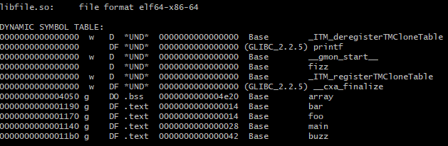

# Shared Object Inspection via objdump

These instructions are for Linux or WSL.

1. Install objdump through the binutils collection.

`sudo apt install binutils`

2. Let's compile the program to just run main first.
In file2.h, `INCLUDE_FILETWO` is set to 1 and `INCLUDE_FILETHREE` is set to 1. 
In file3.h, `COMPILE_IN_ARRAY` is also set to 1, so all symbols in the project are compiled in. To compile the project, run

`clang -c -o src/file2.o src/file2.c`

`clang -c -o src/file3.o src/file3.c`

3. Now link it

`clang -o fileprogram src/file2.o src/file3.o`

4. Now, run it and see all the output so we know it works.

`./fileprogram`

5. Now compile for a shared object library.

`clang -c -fPIC -o src/file2.o src/file2.c`

`clang -c -fPIC -o src/file3.o src/file3.c`

6. Link the project with

`clang -shared -o libfile.so src/file2.o src/file3.o`

7. Inspect the object, run

`objdump -T libfile.so`

which will show that all functions and global variables are compiled into the shared object library.

8. The last column gives the symbol size in hex and the last column is symbol. Either through
adding a pipe to the objdump command above or copying from the command line, get the size in hex
and the symbol name into Excel. I copied the command line output to Notepad++, used the column editor
(Alt+click) to select only the last three columns. I opened Excel and went to the Paste dropdown in
the ribbon, and clicked the use text import wizard option. Select the deliminated option and click next.
Select both tab and space and click next. Select text and click finish. Now, select an empty column
and change the type from text to General. In first cell of the column, type`=DECIMAL(A1,16)` assuming that
the size in hex is in the first column and hit enter. Duplicate the formula down the entire column.

See that the size of the array symbol in base 10 is 20000 which is the 5000 elements allocated times 4 bytes per integer.

9. Ok, now go into file2.h and set `#define INCLUDE_FILETHREE 0`.

10. You only need to recompile `file2.c` because nothing we changed impacts file3.h or file3.c.

`clang -fPIC -o src/file2.o src/file2.c`

11. Now link again using step 6.

12. Repeat step 7. Notice that `array` and `fiz` still exist in the
shared object even though neither are used in file2.c. **Just including `src\file3.o`
in the link command includes it in the shared object.**

13. Since neither `array` nor `fizz` are used in file2.c, link again without `src/file3.o`

`clang -shared -o libfile.so src/file2.o`

Everything links fine.

14. Repeat step 7. Now, see that `array` and `fizz` are not included in the shared library.
Good. They weren't needed so we don not want `array` taking up all that space. However, sometimes
projects I'm on don't currently have a mature enough build system to know to not include
files during linking. They use #if to determine what functionality to include or not.

15. In file3.h, change `COMPILE_IN_ARRAY` to 0. Now recompile file3.c only since
that is the only file that is impacted.

`clang -fPIC -o src/file3.o src/file3.c`

16. Link again with both file2.c and file3.c using the command in step 6.

17. Repeat step 7. Now see that `array` is no longer included in the shared library, but
`fizz` still exists.

# Notes:
#if statements are used to compile out functionality in a project I'm working on, but sometimes
pieces of the functionality appear to be left in. Consider if there are alternatives such as 
linker options that will leave out dead code.

The program can be compiled with `clang src/file2.c -o src/filetwoprogram`.
No -I flags are necessary because the headers are in src/ with the source file.
Remember `clang -c src/file2.c -o src/file2.o` will compile only and then linking is done with `clang src/file2.o -o src/filetwoprogram`.
You can get preprocessor output with `-E` and leave in the preprocessor directive names with `-dD` and the full command is `clang -E -dD src/filetwo.c -o src/filetwo.i`.